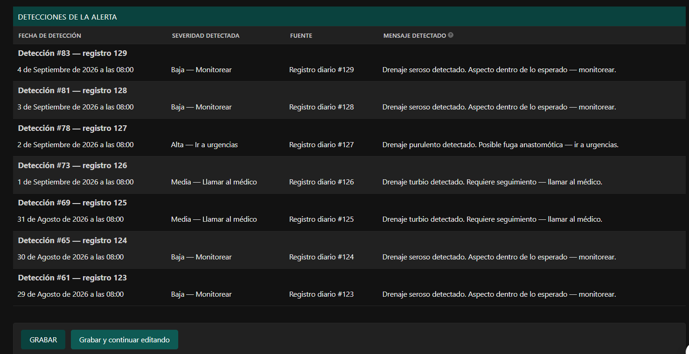

# Monitoreo Posquirúrgico Remoto

Seguimiento clínico a distancia para pacientes en recuperación de cirugía
colorrectal. El paciente responde por WhatsApp; un motor de reglas clasifica sus
signos y avisa al médico cuando algo se sale de lo esperado.

[](https://github.com/Alejandro-Valen/Registro_Post_Quirurgico/actions/workflows/ci.yml)


> **La IA no diagnostica.** El sistema clasifica bajo reglas clínicas fijas,
> derivadas de protocolos ERAS de recuperación colorrectal y trazadas una a una
> a la literatura que las respalda. Ningún umbral se cambia sin decisión
> explícita del responsable clínico del proyecto.

---

## El problema

Después de una cirugía colorrectal el paciente se va a casa entre el día 3 y el
5. Las complicaciones que importan —fuga anastomótica, íleo paralítico, sepsis,
intolerancia oral— aparecen justo en esa ventana, cuando ya nadie lo está
mirando. Lo que hay hoy, en la práctica, es que el paciente decide solo si su
fiebre "es normal".

## Qué hace el sistema

**1 · Pregunta.** Dos veces al día el bot le hace al paciente doce preguntas por
WhatsApp: temperatura, dolor en escala EVA, drenaje (presencia, aspecto y
cantidad), gases, náuseas, tolerancia a líquidos, distensión abdominal y
frecuencia cardíaca. En su idioma, no en jerga: el menú del drenaje dice
"amarillo verdoso o con pus", no "purulento".

**2 · Clasifica.** El motor evalúa cada respuesta contra ocho familias de reglas
con escalera de severidad **BAJA / MEDIA / ALTA**, sensibles a tres cosas que un
umbral simple no ve: la persistencia entre días, el día postoperatorio, y la
tendencia. El mismo dolor de 6/10 es una cosa en el día 1 y otra en el día 8.

**3 · Avisa.** El médico entra a su panel y ve un tablero de triaje: quién
necesita atención ahora, por qué, y su teléfono. Las alertas ALTA salen además
por correo — sin nombre, sin dato clínico y sin identificadores en el cuerpo del
mensaje: solo un enlace al panel.

**4 · Cuenta el silencio como dato.** Un paciente que deja de responder genera
su propia alerta, que escala con los turnos perdidos. La ausencia de datos es
información clínica, no un hueco.

---

## Cómo se ve

> Las tres capturas salen de datos **ficticios** generados con `seed_demo` y
> `seed_demo_produccion`. Los pacientes llevan el prefijo `DEMO —`, cédulas
> `DEMO-000X` y teléfonos reservados. Ningún dato de una persona real ha
> entrado nunca en este repositorio.

### El tablero de triaje

Es lo primero que ve el médico al entrar, y no hay que hacer ningún clic para
saber a quién llamar: nombre, el problema en lenguaje clínico, día
postoperatorio y **teléfono**, ordenado por severidad. El `×8` y el `×7` no son
ocho y siete alertas: son **una sola alerta detectada esas veces** mientras
sigue abierta.


### El detalle de una alerta

La misma alerta de fuga anastomótica, por dentro. La tabla de detecciones es la
evolución real del drenaje: **seroso → turbio → purulento → seroso**, con la
severidad subiendo a ALTA el 2 de septiembre y bajando después.

Siete filas, **una sola alerta**. Si el sistema creara una por check-in, el
médico vería siete avisos del mismo problema y perdería justo lo que importa:
que empeoró y luego cedió.



### La evolución del paciente

Temperatura, dolor y frecuencia cardíaca sobre los diez días de seguimiento, con
los umbrales clínicos dibujados como líneas punteadas. Los tres suben juntos
hasta el día 3 y ceden a la vez.

Dos detalles que no son estéticos: **los puntos grandes marcan los registros con
alerta ALTA sin resolver**, y **un hueco en la línea significa que el paciente no
midió ese dato ese día — no un cero**. Confundir "no sé" con "cero" en una
gráfica clínica es cómo se inventa un hecho.


## Estado

|  |  |
|---|---|
| **Suite** | 366 pruebas |
| **Integración continua** | 9 comprobaciones por PR: suite, `check`, migraciones, configuración de producción, higiene del diff, `gitleaks` sobre la historia completa, control de archivos de entorno, linter y auditoría de dependencias |
| **Despliegue** | **Sin entorno productivo activo.** Ver [`docs/railway_deploy.md`](docs/railway_deploy.md) |
| **Piloto con pacientes reales** | **No.** Ver la sección siguiente |

Esto es un MVP verificado en local. **No es un dispositivo médico certificado.**

### Lo que falta para pacientes reales

No es solo técnico, y conviene decirlo antes que nada:

- **Canal.** La [Resolución 1644 de 2026](https://www.minsalud.gov.co) del
  Ministerio de Salud de Colombia, que derogó la 2654 de 2019, excluye las
  aplicaciones de mensajería instantánea para el intercambio de datos clínicos.
  El sistema encaja en la definición de *telemonitoreo* de esa norma, así que el
  canal actual tendría que sustituirse por una plataforma que cumpla.
- **Habilitación.** El telemonitoreo exige que el prestador esté habilitado en
  el REPS. El trámite no tiene costo y un profesional independiente puede
  habilitarlo desde su domicilio.
- **Consentimiento.** Formato de habeas data (Ley 1581 de 2012) firmado con cada
  paciente: [`docs/FORMATO_CONSENTIMIENTO_HABEAS_DATA.md`](docs/FORMATO_CONSENTIMIENTO_HABEAS_DATA.md).
- **Validación clínica** de las respuestas que el bot le da al paciente.

## Arquitectura

```
WhatsApp ──► Twilio ──► webhook  (firma validada · idempotente por MessageSid)
                            │
                            ▼
                  bot.py  (máquina de estados, lógica pura)
                            │
                            ▼
              RegistroDiario ──► alert_engine.py ──► Alerta
                                      │                │
                              reglas clínicas    outbox durable
                                                       │
                              Django Admin ◄───────────┴──► correo
```

- **`signos_sintomas/`** — el núcleo clínico: modelos, motor de alertas, bot,
  panel del médico.
- **`home/`** — portal público y formulario de contacto.
- **Cuatro tareas programadas** (crear check-ins, recordatorios, cerrar
  vencidos, reintentos y correo), aisladas entre sí: que una falle no impide que
  las demás corran.

**Sobre los tres directorios llamados igual.** De fuera adentro:
`Registro_Post_Quirurgico/` es la raíz del repositorio,
`Registro_Post_Quirurgico/Registro_Post_Quirurgico/` es el proyecto Django
—`manage.py` vive ahí—, y dentro está el paquete de configuración con
`settings.py`. Los comandos de `manage.py` se ejecutan en el segundo. Sí,
confunde; renombrarlo rompería `DJANGO_SETTINGS_MODULE`, el `Dockerfile`, la CI
y las referencias de 28 migraciones, y se decidió que el coste supera al
beneficio.

## Instalación local

Requisitos: **Python 3.13**, **PostgreSQL 18**, **Redis**.

```bash
git clone https://github.com/Alejandro-Valen/Registro_Post_Quirurgico.git
cd Registro_Post_Quirurgico

python -m venv .venv
.venv\Scripts\activate            # Windows  ·  source .venv/bin/activate en Linux/Mac
pip install -e ".[dev]"

cp Registro_Post_Quirurgico/.env.example Registro_Post_Quirurgico/.env
python -c "from django.core.management.utils import get_random_secret_key; print(get_random_secret_key())"
# pega el resultado en SECRET_KEY y completa los datos de la base
```

`.env.example` explica cada variable y trae anotada la trampa que costó horas al
lado de las que la tienen. Vale la pena leerlo entero antes de rellenarlo.

```bash
cd Registro_Post_Quirurgico
python manage.py migrate
python manage.py seed_demo          # datos de demostración (solo con DEBUG=True)
python manage.py runserver          # http://127.0.0.1:8000/admin/
```

`seed_demo` crea un paciente ficticio con diez días de registros y las alertas
que el motor genera a partir de ellos, e imprime las credenciales de acceso al
terminar. Es la forma más rápida de ver el sistema funcionando.

En Windows, `inicio_entornoR.bat` activa el entorno y recuerda estos comandos.

### Pruebas

```bash
python manage.py test --noinput                                    # completa, ~2 min
python manage.py test signos_sintomas.tests.test_alert_engine --noinput   # un tema, segundos
```

Y desde la raíz del repositorio:

```bash
ruff check .
pip-audit --strict --skip-editable
```

## Documentación

| | |
|---|---|
| [Reglas del motor de alertas](docs/reglas_clinicas.md) | Las ocho familias de reglas, sus umbrales y la evidencia de cada uno |
| [Modelo de datos](docs/modelos_datos.md) | Qué guarda cada campo y por qué |
| [Bot de WhatsApp](docs/bot_whatsapp.md) | Máquina de estados y reglas de redacción |
| [Despliegue](docs/railway_deploy.md) · [Tareas programadas](docs/cron_setup.md) | Operación |
| [Trampas conocidas](docs/trampas_conocidas.md) | Errores que ya costaron horas. Léelo antes de tocar despliegue o cron |
| [Decisiones D1–D17](docs/decisiones_correccion_auditoria.md) | Cada corrección post-auditoría con su razonamiento completo |
| [Evidencia clínica](docs/auditoria_literatura/) | La literatura que respalda —o no— cada umbral |
| [Cómo contribuir](CONTRIBUTING.md) · [Seguridad](SECURITY.md) | |

El cuaderno de trabajo del equipo —bitácora sesión por sesión, informes de
auditoría, guiones de sesión y scripts de verificación— vive en
[`proceso/`](proceso/). No hace falta leerlo para usar ni extender el sistema.

## Cómo se verifica aquí

Dos auditorías independientes bloquearon sendos *pull requests*, en julio de
2026. La primera encontró que la escalera de severidad de las alertas por
silencio **nunca escalaba en producción**, y que 280 pruebas en verde lo dejaban
pasar porque estaban escritas mirando el código en vez del requisito.

Una tercera auditoría, en septiembre, encontró algo peor y más general: **varias
de las guardias automáticas del proyecto estaban escritas de forma que no podían
fallar.** La comprobación de configuración de producción reportaba los problemas
y salía con código 0; el escáner de secretos excluía justo la carpeta que tenía
datos personales.

De ahí salieron las dos reglas que gobiernan el proyecto:

1. **Un test en verde no prueba nada si no se sabe por qué está verde.** Antes
   de dar por buena una comprobación se rompe el código a propósito y se
   verifica que cae.
2. **Toda corrección se verifica en las dos direcciones:** que atrapa lo que debe
   atrapar, y que deja pasar lo que debe pasar. Comprobar solo la primera mitad
   es cómo se da por bueno un arnés roto.

Los informes de las tres auditorías están en
[`proceso/auditorias/`](proceso/auditorias/), completos, con los hallazgos que
no supimos ver. Los scripts que reproducen cada verificación están en
[`proceso/verificaciones/`](proceso/verificaciones/).

## Equipo

- **León Arboleda** ([@arboledaLeon](https://github.com/arboledaLeon)) —
  lógica clínica, arquitectura, desarrollo e infraestructura.
- **Alejandro Valencia** ([@Alejandro-Valen](https://github.com/Alejandro-Valen)) —
  lógica clínica, arquitectura, desarrollo e infraestructura.

El proyecto no tiene afiliación institucional formal a la fecha.

## Licencia

Todos los derechos reservados. Ver [LICENSE](LICENSE) — incluye el aviso clínico
y el porqué de que no sea una licencia abierta.
